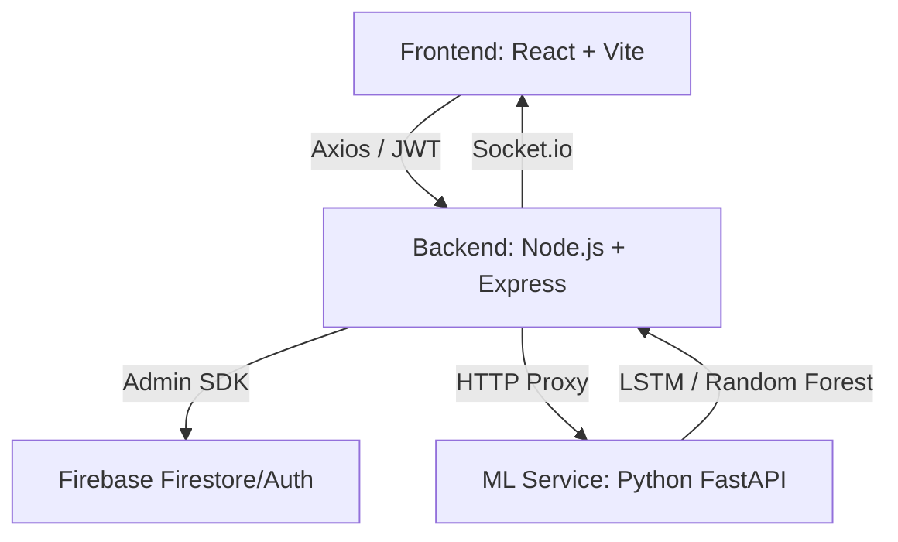

# StockMind AI — Intelligent Market Terminal

StockMind AI is a state-of-the-art stock analysis platform built to demonstrate the integration of modern web technologies with advanced Machine Learning. This project was developed as a comprehensive demonstration of high-performance, accessible, and predictive UI/UX.

---

## 🏛️ College Project Context
This project serves as a capstone demonstration of full-stack development, real-time data synchronization, and predictive modeling. It bridges the gap between raw financial data and actionable user insights.

### 🎯 Landing Page Strategy: The "Conversion Engine"
Rather than a traditional website, the landing page is designed as a focused **Conversion Engine**. 
- **AIDA Framework:** Follows Attention, Interest, Desire, and Action to guide users.
- **Visual Hierarchy:** Directs user attention to key metrics and calls-to-action through modern glassmorphism design.
- **Accessibility:** Built with WCAG AAA standards (15.3:1 contrast) to ensure inclusivity.

---

## 🧠 AI Core: LSTM (Long Short-Term Memory)
The heart of StockMind AI's predictive capability is the **LSTM Neural Network**, specifically designed for time-series data.

### Why LSTM?
Traditional AI often treats data points in isolation. LSTM is a type of Recurrent Neural Network (RNN) that "remembers" sequences.
- **The Notebook Analogy:** LSTM acts like a researcher with a notebook. It uses a **Cell State** to remember significant market events from months ago while still processing today's volatility.
- **Gate Mechanism:** It uses Forget, Input, and Output gates to selectively update its "memory," making it the gold standard for stock price forecasting.

---

## 🛠️ System Architecture



### Request Flow
1. **User Action** → React Component
2. **apiClient.js** → Node.js Backend (JWT Verified)
3. **ML Service** → Processes LSTM Model → Prediction
4. **Data Aggregation** → Alpha Vantage + Firestore
5. **Real-time Update** → Socket.io pushes to UI

---

## 🚀 Technology Stack

| Layer          | Technology                    | Purpose                        |
| :------------- | :---------------------------- | :----------------------------- |
| **Frontend**   | React 19 + Vite               | Fast, Component-based UI       |
| **Backend**    | Node.js + Express             | Core Logic & API Gateway       |
| **Real-time**  | Socket.io                     | Live Price Streaming           |
| **Database**   | Firebase Firestore            | User Portfolios & Alerts       |
| **ML Service** | Python FastAPI + TensorFlow   | LSTM Price Prediction          |

---

## 🏃 Running Locally

### 1. Frontend
```bash
cd stock-market
npm install
npm run dev
```

### 2. Backend
```bash
cd stock-market/backend
npm install
npm run dev
```

### 3. ML Service
```bash
cd stock-market/ml-service
pip install -r requirements.txt
python main.py
```

---

## 📡 Socket.io Event Reference

| Event               | Direction        | Payload                                      |
| :------------------ | :--------------- | :------------------------------------------- |
| `subscribe:stock`   | Client → Server  | `"AAPL"`                                     |
| `price:update`      | Server → Client  | `{ symbol, price, change, volume }`          |
| `prediction:update` | Server → Client  | `{ predictedPrice, confidence, trend }`      |

---

Developed with ❤️ for the **Advanced Agentic Coding** Internship.
